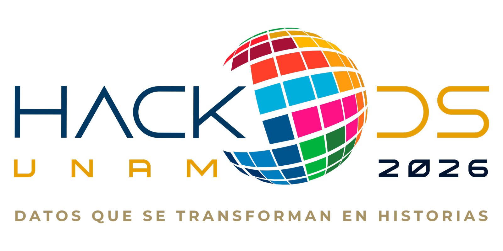

```{python}
#| output: asis
#| echo: false
print('<style>')
print('''
/* ============================================================
   VARIABLES & RESET
   ============================================================ */
:root {
  --rosa:        #C05A6E;
  --rosa-claro:  #E8517A;
  --rosa-bg:     #f5dce2;
  --rosa-header: #b85068;
  --verde:       #8B9645;
  --azul:        #2B4C6F;
  --gris-claro:  #f7f5f3;
  --gris-borde:  #e2ddd8;
  --texto:       #1a1a1a;
  --texto-muted: #6b6560;
  --blanco:      #ffffff;

  --font-display: 'Helvetica', Georgia, serif;
  --font-body:    'Times New Roman', sans-serif;

  --radius: 12px;
  --sombra: 0 2px 12px rgba(0,0,0,0.07);
}

* { box-sizing: border-box; }

html {
  scroll-behavior: smooth;
}

body {
  font-family: var(--font-body);
  background: var(--gris-claro);
  color: var(--texto);
  margin: 0 !important;
  padding: 0 !important;
}

/* Quarto overrides */
#quarto-content,
.page-layout-full #quarto-content, 
#quarto-document-content, .quarto-container, div.quarto-post, .page-full {
  padding: 0 !important;
  margin: 0 !important;
  max-width: 100% !important;
}
.quarto-title-block,
h1.title,
#title-block-header,
.quarto-title-banner,
header#quarto-header,
#quarto-margin-sidebar,
.quarto-sidebar,
nav#quarto-sidebar,
#quarto-toc-target,
.toc-active {
  display: none !important;
}

main-content, main#quarto-document-content {
  padding: 0 !important;
  margin: 0 !important;
}

body.fullcontent{
  padding-top: 0 !important;
}

/* ============================================================
   NAV HEADER
   ============================================================ */
.nav-header {
  background: var(--rosa-header);
  color: white;
  display: flex;
  align-items: center;
  justify-content: space-between;
  padding: 0 2.5rem;
  height: 56px;
  position: sticky;
  top: 0;
  z-index: 1000;
  box-shadow: 1px solid rgba(0,0,0,0.4);
}
.nav-header p {
  margin: 0;
  display: flex;
  align-items: center;
}
.nav-header p a {
  display: flex;
  align-items: center;
}
.nav-header .nav-logo {
  height: 40px;
  width: auto;
  object-fit: contain;
  vertical-align: middle;
  margin-right: 1rem;
}
.nav-header .nav-logo-unam {
  height: 40px;
  width: auto;
  object-fit: contain;
  vertical-align: middle;
}
.nav-header nav {
  display: flex;
  gap: 1.5rem;
}
.nav-header nav a {
  color: white;
  text-decoration: none;
  font-size: 0.95rem;
  font-weight: 500;
  letter-spacing: 0.05em;
  opacity: 0.75;
  transition: opacity .2s;
}
.nav-header nav a:hover { opacity: 1; }
/* ============================================================
   PAGE WRAPPER
   ============================================================ */
.page-wrapper {
  max-width: 1100px;
  margin: 0 auto;
  padding: 1.5rem 2rem 4rem;
}

/* ============================================================
   HERO SECTION
   ============================================================ */
.hero {
  display: grid;
  grid-template-columns: 1fr 280px;
  gap: 1rem;
  margin-bottom: 1.5rem;
  align-items: start;
}
.hero-left .ods-tags {
  display: flex;
  gap: 0.33rem;
  margin-bottom: 1rem;
}
.ods-tag {
  background: var(--rosa-bg);
  color: var(--rosa-header);
  font-size: 1rem;
  font-weight: 700;
  padding: 5px 10px;
  border-radius: 20px;
  letter-spacing: 0.03em;
}
.hero-left h1 {
  font-family: var(--font-display);
  font-size: 2.4rem;
  line-height: 1.15;
  color: var(--rosa-header);
  margin: 0 0 1rem;
  font-weight: 900;
}
.hero-left p {
  font-size: 0.97rem;
  line-height: 1.50;
  color: var(--texto-muted);
  margin: 0;
  max-width: 560px;
}
.hero-right {
  background: #c9d5d8;
  border-radius: var(--radius);
  padding: 1.2rem 1.2rem;
  font-size: 0.82rem;
  color: #3a4a50;
  min-height: 130px;
  display: flex;
  flex-direction: column;
  justify-content: space-between;
}
.hero-right .fuentes-title {
  font-weight: 700;
  font-size: 0.78rem;
  text-transform: uppercase;
  letter-spacing: 0.06em;
  margin-bottom: 0.5rem;
  color: #2b3e45;
}
.hero-right a { color: var(--azul); font-weight: 600; }
.hero-right {
  font-style: italic;
  font-size: 0.78rem;
  color: #556;
  margin-top: 0.4rem;
}
.nota {
  font-style: italic;
  font-size: 0.28rem;
  color: #556;
  margin-top: 0.4rem;
}

/* ============================================================
   KPI CARDS
   ============================================================ */
.kpi-grid {
  display: grid;
  grid-template-columns: repeat(4, 1fr);
  gap: 1rem;
  margin-bottom: 2.5rem;
}
.kpi-card {
  background: white;
  border-radius: var(--radius);
  padding: 0.8rem 1rem 0.8rem;
  box-shadow: var(--sombra);
  border-top: 3px solid var(--rosa-claro);
}
.kpi-card .kpi-label {
  font-size: 0.68rem;
  font-weight: 700;
  text-transform: uppercase;
  letter-spacing: 0.08em;
  color: var(--rosa-claro);
  margin-bottom: 0.3rem;
}
.kpi-card .kpi-value {
  font-family: var(--font-display);
  font-size: 2rem;
  font-weight: 900;
  color: var(--texto);
  line-height: 1;
  margin-bottom: 0.5rem;
}
.kpi-card .kpi-desc {
  font-size: 0.78rem;
  color: var(--texto-muted);
  line-height: 1.45;
}

/* ============================================================
   SECTION TITLES
   ============================================================ */
.section-title {
  font-family: var(--font-display);
  font-size: 1.6rem;
  font-weight: 700;
  color: var(--rosa-header);
  margin: 0 0 0.3rem;
}
.section-subtitle {
  font-size: 0.88rem;
  color: var(--texto-muted);
  margin: 0 0 1.5rem;
}

/* ============================================================
   TWO-COLUMN LAYOUTS
   ============================================================ */
.two-col {
  display: grid;
  gap: 1.5rem;
  margin-bottom: 2.5rem;
  align-items: start;
}
.two-col.col-6-4 { grid-template-columns: 1fr 280px; }
.two-col.col-4-6 { grid-template-columns: 280px 1fr; }
.two-col.col-5-5 { grid-template-columns: 1fr 1fr; }

/* ============================================================
   CHART CARDS
   ============================================================ */
.chart-card {
  background: white;
  border-radius: var(--radius);
  box-shadow: var(--sombra);
  padding: 0.6rem 1.4rem;
  overflow: hidden;
  margin-bottom: 0.8rem;
}
.chart-card .chart-title {
  font-size: 0.82rem;
  font-weight: 700;
  text-transform: uppercase;
  letter-spacing: 0.05em;
  color: var(--texto-muted);
  margin-bottom: 0.8rem;
  padding-bottom: 0.6rem;
  border-bottom: 1px solid var(--gris-borde);
}

/* ============================================================
   INTERPRETACIÓN CARD
   ============================================================ */
.interp-card {
  background: white;
  border-radius: var(--radius);
  box-shadow: var(--sombra);
  padding: 1.4rem 1.6rem;
  font-size: 0.91rem;
  line-height: 1.75;
  color: var(--texto-muted);
  border-left: 4px solid var(--rosa-claro);
  margin-bottom: 2.5rem;
}
.interp-card strong { color: var(--texto); }

/* ============================================================
   THUMBNAIL GRID (miniaturas clickeables)
   ============================================================ */
.thumbs-panel {
  display: flex;
  flex-direction: column;
  gap: 0.5rem;
}
.thumb-card {
  background: white;
  border-radius: var(--radius);
  box-shadow: var(--sombra);
  padding: 0.5rem 1rem;
  cursor: pointer;
  border: 2px solid transparent;
  transition: border-color .2s, box-shadow .2s;
  text-decoration: none;
  color: inherit;
  display: block;
  scroll-behavior: smooth;
}
.thumb-card:hover {
  border-color: var(--rosa-claro);
  box-shadow: 0 4px 18px rgba(232,81,122,0.13);
}
.thumb-card .thumb-label {
  font-size: 0.72rem;
  font-weight: 700;
  text-transform: uppercase;
  letter-spacing: 0.06em;
  color: var(--rosa-claro);
  margin-bottom: 0.2rem;
}
.thumb-card .thumb-desc {
  font-size: 0.8rem;
  color: var(--texto-muted);
  line-height: 1.4;
}

/* ============================================================
   ACCIONES SECTION
   ============================================================ */
.acciones-intro {
  background: var(--rosa-bg);
  border-radius: var(--radius);
  padding: 1.3rem 1.6rem;
  margin-bottom: 2rem;
  font-size: 0.95rem;
  line-height: 1.7;
  color: var(--texto);
}
.acciones-intro strong { color: var(--rosa-header); }

.acciones-grid {
  display: grid;
  grid-template-columns: repeat(3, 1fr);
  gap: 1.2rem;
  margin-bottom: 2.5rem;
}
.accion-card {
  background: white;
  border-radius: var(--radius);
  box-shadow: var(--sombra);
  padding: 1.4rem 1.5rem;
}
.accion-card .accion-icon {
  font-size: 1.5rem;
  margin-bottom: 0.6rem;
}
.accion-card h3 {
  font-family: var(--font-display);
  font-size: 1rem;
  font-weight: 700;
  color: var(--rosa-header);
  margin: 0 0 0.8rem;
}
.accion-card p, .accion-card li {
  font-size: 0.84rem;
  line-height: 1.65;
  color: var(--texto-muted);
  margin: 0 0 0.5rem;
}
.accion-card strong { color: var(--texto); }

/* ============================================================
   FOOTER
   ============================================================ */
.footer-note {
  text-align: center;
  font-size: 0.78rem;
  color: var(--texto-muted);
  padding: 1.5rem 0 0;
  border-top: 1px solid var(--gris-borde);
  margin-top: 1rem;
}

/* ============================================================
   SECTION ANCHOR (para navegación)
   ============================================================ */
.section-anchor {
  scroll-margin-top: 70px;
}

/* ============================================================
   RESPONSIVE
   ============================================================ */
@media (max-width: 760px) {
  .hero, .two-col.col-6-4, .two-col.col-4-6, .two-col.col-5-5,
  .kpi-grid, .acciones-grid {
    grid-template-columns: 1fr;
  }
  .hero-left h1 { font-size: 1.7rem; }
  .kpi-grid { grid-template-columns: repeat(2, 1fr); }
}
''')
print('</style>')
```

```{python}
#| include: false

import pandas as pd
import numpy as np
import plotly.graph_objects as go
import warnings
warnings.filterwarnings('ignore')

df = pd.read_csv('../data/dataset_final_tablero.csv', parse_dates=['fecha'])
df_clean = df.dropna(subset=['ingreso_hombres', 'ingreso_mujeres']).copy()

# KPIs
brecha_promedio      = df_clean['brecha_salarial'].mean() * 100
ultimo_pob_jef_muj   = df_clean['pob_jefatura_mujeres'].iloc[-1]
ultimo_pob_muj       = df_clean['pobreza_mujeres'].iloc[-1]
ultimo_pob_hom       = df_clean['pobreza_hombres'].iloc[-1]
ratio_pobreza_mh     = round(ultimo_pob_muj / ultimo_pob_hom, 1)
ultimo_pob_inf       = df_clean['pobreza_informal'].iloc[-1]
ultimo_pob_for       = df_clean['pobreza_formal'].iloc[-1]
ratio_informalidad   = round(ultimo_pob_inf / ultimo_pob_for, 1)
pct_promedio_hist    = (1 - df_clean['brecha_salarial'].mean()) * 100

COLOR_MASCULINO = '#8B9645'
COLOR_FEMENINO  = '#E8517A'
COLOR_AZUL      = '#2B4C6F'

CHART_LAYOUT = dict(
    plot_bgcolor='white',
    paper_bgcolor='white',
    font=dict(family='DM Sans, Arial, sans-serif', size=11),
    margin=dict(l=50, r=20, t=30, b=50),
    legend=dict(orientation='h', y=1.08, x=0, font=dict(size=10)),
)
```

```{=html}
<!-- ============================================================
     NAV HEADER
     ============================================================ -->
```

::: nav-header
[{.nav-logo}{.nav-logo-unam}](https://www.hackods.unam.mx/)

<nav>[Datos](#datos){.nav-link} [Brecha](#brecha){.nav-link} [Acciones](#acciones){.nav-link}</nav>
:::

```{=html}
<!-- ============================================================
     PAGE WRAPPER START
     ============================================================ -->
```

:::::::::::::::::::::::::::::::::::::::: page-wrapper
```{=html}
<!-- ============================================================
     SECCIÓN: DATOS
     ============================================================ -->
```

::::::::::::::::::::: {#datos .section-anchor}
<!-- HERO -->

:::::: hero
:::: hero-left
::: ods-tags
[ODS 1]{.ods-tag} [ODS 5]{.ods-tag}
:::

## Trabajar no es suficiente: El género define quién cae en la pobreza {.section-title style="font-family:'Helvetica',serif;font-size:2.4rem;line-height:1.15;color:#b85068;font-weight:900;margin:0 0 1rem;"}

**En México, el empleo no garantiza una vida digna para todos.** Mientras persista la brecha salarial, las mujeres seguirán siendo las más vulnerables a la _pobreza laboral_. Este análisis explora cómo la discriminación de ingresos y la informalidad actúan como trampas económicas que impiden alcanzar el fin de la pobreza sin antes lograr una verdadera igualdad de género.


::::

:::: {style="display: flex; flex-direction: column; gap: 0.8rem;"}
::: {.hero-right style="min-height: auto; padding: 1rem;"}
[FUENTES DE DATOS]{.fuentes-title}

Datos del **INEGI** ([ENOE](https://www.inegi.org.mx/programas/enoe/15ymas/)) y **CONEVAL** ([ITLP](https://www.coneval.org.mx/Medicion/Paginas/ITLP-IS_pobreza_laboral.aspx)).
:::

::: {.hero-right style="min-height: auto; padding: 1rem;"}
[POBREZA LABORAL]{.fuentes-title}

[Ver definición oficial del CONEVAL ↗](https://blog.coneval.org.mx/2023/02/21/que-es-pobreza-laboral/)


:::
::::
::::::

<!-- KPIs -->

::::::: kpi-grid
::: kpi-card
[BRECHA SALARIAL]{.kpi-label}

```{python}
from IPython.display import Markdown
Markdown(f'<div class="kpi-value">{brecha_promedio:.1f}%</div><div class="kpi-desc">Diferencia promedio histórica entre el ingreso de las mujeres y los hombres.</div>')
```
:::

::: kpi-card
[HOGARES EN POBREZA]{.kpi-label}

```{python}
Markdown(f'<div class="kpi-value">{ultimo_pob_jef_muj:.1f}%</div><div class="kpi-desc">Porcentaje de los hogares en pobreza cuya jefatura está a cargo de una mujer.</div>')
```
:::

::: kpi-card
[EXPOSICIÓN A LA POBREZA]{.kpi-label}

```{python}
Markdown(f'<div class="kpi-value">{ratio_pobreza_mh}:1</div><div class="kpi-desc">Radio de mujeres a hombres que viven en la pobreza laboral.</div>')
```
:::

::: kpi-card
[EMPLEO INFORMAL]{.kpi-label}

```{python}
Markdown(f'<div class="kpi-value">{ratio_informalidad}:1</div><div class="kpi-desc">Radio de pobreza laboral en sector informal vs formal.</div>')
```
:::
:::::::

<!-- GRÁFICA PRINCIPAL + MINIATURAS -->

::: section-title
¿La pobreza viene de la brecha salarial?
:::

[Trazando la diferencia histórica entre el ingreso de las mujeres y los hombres.]{.section-subtitle}

::::::::: {.two-col .col-6-4}
::: chart-card
[INGRESO PROMEDIO MENSUAL: HOMBRES VS MUJERES (2005–2024)]{.chart-title}

```{python}
fig = go.Figure()

fig.add_trace(go.Scatter(
    x=pd.concat([df_clean['fecha'], df_clean['fecha'][::-1]]),
    y=pd.concat([df_clean['ingreso_hombres'], df_clean['ingreso_mujeres'][::-1]]),
    fill='toself',
    fillcolor='rgba(232, 81, 122, 0.07)',
    line=dict(color='rgba(0,0,0,0)'),
    showlegend=False,
    hoverinfo='skip'
))
fig.add_trace(go.Scatter(
    x=df_clean['fecha'], y=df_clean['ingreso_hombres'],
    name='Hombres', line=dict(color=COLOR_MASCULINO, width=2.5), mode='lines',
    hovertemplate='Hombres<br>%{x|%Y-%m}: $%{y:,.0f}<extra></extra>'
))
fig.add_trace(go.Scatter(
    x=df_clean['fecha'], y=df_clean['ingreso_mujeres'],
    name='Mujeres', line=dict(color=COLOR_FEMENINO, width=2.5), mode='lines',
    hovertemplate='Mujeres<br>%{x|%Y-%m}: $%{y:,.0f}<extra></extra>'
))

fig.update_layout(
    **CHART_LAYOUT,
    height=400,
    xaxis=dict(title='Periodo', gridcolor='rgba(0,0,0,0.05)', dtick='M24'),
    yaxis=dict(title='Ingreso promedio mensual ($)', gridcolor='rgba(0,0,0,0.05)', range=[4500, 8800]),
    annotations=[dict(
        x=df_clean['fecha'].iloc[len(df_clean)//2],
        y=(df_clean['ingreso_hombres'].mean() + df_clean['ingreso_mujeres'].mean()) / 2
    )]
)
fig.show()
```
:::

::::::: thumbs-panel
[[↓ Pobreza por sexo]{.thumb-label}  <br>  [Tasas de pobreza laboral entre hombres y mujeres ocupados por año.]{.thumb-desc}](#chart-pob-sexo){.thumb-card}

[[↓ Formal vs Informal]{.thumb-label}  <br>  [Cómo el tipo de empleo amplifica la vulnerabilidad económica.]{.thumb-desc}](#chart-informal){.thumb-card}

[[↓ Ratio salarial]{.thumb-label}  <br>  [Proporción histórica del ingreso femenino respecto al masculino.]{.thumb-desc}](#chart-ratio){.thumb-card}

[[↓ Jefatura de hogar]{.thumb-label}  <br>  [Pobreza laboral analizada por sexo del jefe o jefa de familia.]{.thumb-desc}](#chart-jefatura){.thumb-card}
:::::::
:::::::::

<!-- INTERPRETACIÓN -->

::: interp-card
La brecha salarial de género en México ha sido una constante estructural durante las últimas dos décadas. Aunque ha mostrado una **leve tendencia a la baja** — pasando de aproximadamente **27.9% en 2005 a 19.9% en 2024** — la diferencia absoluta de ingresos entre hombres y mujeres sigue siendo significativa. Los datos del INEGI (ENOE) revelan que el ingreso promedio mensual de los hombres se ha mantenido consistentemente entre **\$6,400 y \$8,100**, mientras que el de las mujeres oscila entre **\$4,900 y \$6,400**. Esta disparidad empuja sistemáticamente a más mujeres por debajo de la Línea de Pobreza Extrema por Ingresos definida por CONEVAL, evidenciando que la simple inserción laboral femenina **no basta** si persisten las condiciones de desigualdad salarial y la alta concentración en el sector informal.
:::
:::::::::::::::::::::

```{=html}
<!-- ============================================================
     SECCIÓN: BRECHA
     ============================================================ -->
```

:::::::::: {#brecha .section-anchor}
::: section-title
Por cada salario de un hombre, ¿cuánto gana una mujer?
:::

[Visualizando la disparidad. Históricamente, las mujeres en México perciben menos del 80% del salario masculino.]{.section-subtitle}

::::: {.two-col .col-4-6}
::: {#chart-pob-sexo .chart-card .section-anchor}
[POBREZA LABORAL POR SEXO (PROMEDIO ANUAL)]{.chart-title}

```{python}
anual_muj = df_clean.groupby(df_clean['fecha'].dt.year)['pobreza_mujeres'].mean()
anual_hom = df_clean.groupby(df_clean['fecha'].dt.year)['pobreza_hombres'].mean()
anios = anual_muj.index

fig2 = go.Figure()
fig2.add_trace(go.Bar(
    x=anios, y=anual_muj.values, name='Mujeres',
    marker_color=COLOR_FEMENINO, opacity=0.85,
    hovertemplate='Mujeres %{x}: %{y:.1f}%<extra></extra>'
))
fig2.add_trace(go.Bar(
    x=anios, y=anual_hom.values, name='Hombres',
    marker_color=COLOR_MASCULINO, opacity=0.85,
    hovertemplate='Hombres %{x}: %{y:.1f}%<extra></extra>'
))
fig2.update_layout(
    **CHART_LAYOUT,
    barmode='group', bargap=0.15, bargroupgap=0.05, height=370,
    xaxis=dict(title='Año', gridcolor='rgba(0,0,0,0.05)'),
    yaxis=dict(title='Pobreza laboral (%)', gridcolor='rgba(0,0,0,0.05)')
)
fig2.show()
```
:::

::: {#chart-ratio .chart-card .section-anchor}
[¿CUÁNTO GANAN LAS MUJERES RESPECTO A LOS HOMBRES? (%)]{.chart-title}

```{python}
ratio_ts = (df_clean['ingreso_mujeres'] / df_clean['ingreso_hombres']) * 100
fig3 = go.Figure()
fig3.add_trace(go.Scatter(
    x=df_clean['fecha'], y=ratio_ts,
    name='Proporción Real', line=dict(color=COLOR_AZUL, width=2.5), mode='lines',
    hovertemplate='Ratio: %{y:.1f}%<br>%{x|%Y-%m}<extra></extra>'
))
fig3.add_hline(y=100, line_dash="dash", line_color=COLOR_MASCULINO, line_width=1.5,
    annotation_text="Paridad Salarial (100%)", annotation_position="bottom right",
    annotation_font_size=10, annotation_font_color=COLOR_MASCULINO)
fig3.add_hline(y=pct_promedio_hist, line_dash="dot", line_color=COLOR_FEMENINO, line_width=1.5,
    annotation_text=f"Promedio Histórico ({pct_promedio_hist:.1f}%)",
    annotation_position="bottom right", annotation_font_size=10,
    annotation_font_color=COLOR_FEMENINO)
fig3.update_layout(
    **CHART_LAYOUT, height=370,
    xaxis=dict(title='Año', gridcolor='rgba(0,0,0,0.05)', dtick='M24'),
    yaxis=dict(title='Porcentaje (%)', gridcolor='rgba(0,0,0,0.05)', range=[50, 110])
)
fig3.show()
```
:::
:::::

::::: {.two-col .col-5-5}
::: {#chart-informal .chart-card .section-anchor}
[POBREZA LABORAL: FORMAL VS INFORMAL]{.chart-title}

```{python}
fig4 = go.Figure()
fig4.add_trace(go.Scatter(
    x=df_clean['fecha'], y=df_clean['pobreza_informal'],
    name='Sector Informal', line=dict(color=COLOR_FEMENINO, width=2.5), mode='lines',
    hovertemplate='Informal<br>%{x|%Y-%m}: %{y:.1f}%<extra></extra>'
))
fig4.add_trace(go.Scatter(
    x=df_clean['fecha'], y=df_clean['pobreza_formal'],
    name='Sector Formal', line=dict(color=COLOR_MASCULINO, width=2.5), mode='lines',
    hovertemplate='Formal<br>%{x|%Y-%m}: %{y:.1f}%<extra></extra>'
))
fig4.update_layout(
    **CHART_LAYOUT, height=360,
    xaxis=dict(title='Periodo', gridcolor='rgba(0,0,0,0.05)', dtick='M24'),
    yaxis=dict(title='Pobreza laboral (%)', gridcolor='rgba(0,0,0,0.05)')
)
fig4.show()
```
:::

::: chart-card
[CORRELACIÓN: BRECHA SALARIAL VS POBREZA LABORAL FEMENINA]{.chart-title}

```{python}
fig5 = go.Figure()
fig5.add_trace(go.Scatter(
    x=df_clean['brecha_salarial'] * 100, y=df_clean['pobreza_mujeres'],
    mode='markers',
    marker=dict(
        color=df_clean['fecha'].dt.year,
        colorscale=[[0, COLOR_MASCULINO], [1, COLOR_FEMENINO]],
        size=8, opacity=0.75,
        colorbar=dict(title='Año', thickness=12, len=0.6),
        line=dict(width=0.5, color='white')
    ),
    hovertemplate='Brecha: %{x:.1f}%<br>Pobreza fem.: %{y:.1f}%<extra></extra>',
    name='Trimestral'
))
z = np.polyfit(df_clean['brecha_salarial'] * 100, df_clean['pobreza_mujeres'], 1)
p = np.poly1d(z)
x_line = np.linspace(df_clean['brecha_salarial'].min()*100, df_clean['brecha_salarial'].max()*100, 50)
fig5.add_trace(go.Scatter(
    x=x_line, y=p(x_line), mode='lines',
    line=dict(color=COLOR_FEMENINO, width=2, dash='dash'),
    name='Tendencia', hoverinfo='skip'
))
fig5.update_layout(
    **CHART_LAYOUT, height=360,
    xaxis=dict(title='Brecha salarial (%)', gridcolor='rgba(0,0,0,0.05)'),
    yaxis=dict(title='Pobreza laboral femenina (%)', gridcolor='rgba(0,0,0,0.05)')
)
fig5.show()
```
:::
:::::
::::::::::

```{=html}
<!-- ============================================================
     SECCIÓN: ACCIONES
     ============================================================ -->
```

:::::::::::: {#acciones .section-anchor}
::::: {.two-col .col-5-5}
::: {#chart-jefatura .chart-card .section-anchor}
[POBREZA LABORAL POR JEFATURA DE HOGAR Y SEXO]{.chart-title}

```{python}
fig6 = go.Figure()
fig6.add_trace(go.Scatter(
    x=pd.concat([df_clean['fecha'], df_clean['fecha'][::-1]]),
    y=pd.concat([df_clean['pob_jefatura_mujeres'], df_clean['pob_jefatura_hombres'][::-1]]),
    fill='toself', fillcolor='rgba(232,81,122,0.08)',
    line=dict(color='rgba(0,0,0,0)'), showlegend=False, hoverinfo='skip'
))
fig6.add_trace(go.Scatter(
    x=df_clean['fecha'], y=df_clean['pob_jefatura_mujeres'],
    name='Jefatura Femenina', line=dict(color=COLOR_FEMENINO, width=2.5),
    hovertemplate='Jef. Femenina<br>%{x|%Y-%m}: %{y:.1f}%<extra></extra>'
))
fig6.add_trace(go.Scatter(
    x=df_clean['fecha'], y=df_clean['pob_jefatura_hombres'],
    name='Jefatura Masculina', line=dict(color=COLOR_MASCULINO, width=2.5),
    hovertemplate='Jef. Masculina<br>%{x|%Y-%m}: %{y:.1f}%<extra></extra>'
))
fig6.add_trace(go.Scatter(
    x=df_clean['fecha'], y=df_clean['pob_jefatura_nal'],
    name='Nacional', line=dict(color=COLOR_AZUL, width=1.5, dash='dot'),
    hovertemplate='Nacional<br>%{x|%Y-%m}: %{y:.1f}%<extra></extra>'
))
fig6.update_layout(
    **CHART_LAYOUT, height=380,
    xaxis=dict(title='Periodo', gridcolor='rgba(0,0,0,0.05)', dtick='M24'),
    yaxis=dict(title='Hogares en pobreza laboral (%)', gridcolor='rgba(0,0,0,0.05)')
)
fig6.show()
```
:::

::: chart-card
[EVOLUCIÓN DE LA BRECHA SALARIAL (%)]{.chart-title}

```{python}
brecha_pct = df_clean['brecha_salarial'] * 100
fig7 = go.Figure()
fig7.add_trace(go.Scatter(
    x=df_clean['fecha'], y=brecha_pct,
    name='Brecha Salarial', line=dict(color=COLOR_FEMENINO, width=2.5),
    fill='tozeroy', fillcolor='rgba(232,81,122,0.1)', mode='lines',
    hovertemplate='Brecha: %{y:.1f}%<br>%{x|%Y-%m}<extra></extra>'
))
rolling = brecha_pct.rolling(window=4, min_periods=1).mean()
fig7.add_trace(go.Scatter(
    x=df_clean['fecha'], y=rolling,
    name='Tendencia (12M)', line=dict(color=COLOR_AZUL, width=2, dash='dash'),
    mode='lines', hovertemplate='Tendencia: %{y:.1f}%<br>%{x|%Y-%m}<extra></extra>'
))
fig7.update_layout(
    **CHART_LAYOUT, height=380,
    xaxis=dict(title='Periodo', gridcolor='rgba(0,0,0,0.05)', dtick='M24'),
    yaxis=dict(title='Brecha salarial (%)', gridcolor='rgba(0,0,0,0.05)')
)
fig7.show()
```
:::
:::::

::: acciones-intro
Los datos evidencian una realidad estructural: **la pobreza laboral en México tiene rostro de mujer**. La brecha salarial de género no es solo un indicador numérico — es el mecanismo que condena a millones de mujeres a vivir por debajo de la línea de pobreza extrema, aun cuando trabajan. Las acciones necesarias son urgentes y deben operar en múltiples niveles.
:::

:::::: acciones-grid
::: accion-card
[🏛️]{.accion-icon}

### Política Pública

**1. Formalización del empleo femenino** — Solo el 0.8% de trabajadores formales están en pobreza laboral, frente al 20.1% en informalidad. Programas de formalización orientados a mujeres reducirían drásticamente la pobreza.

**2. Legislación de equidad salarial** — Implementar leyes de transparencia salarial que obliguen a las empresas a reportar brechas y corregirlas.

**3. Sistema nacional de cuidados** — La informalidad femenina está ligada a las responsabilidades de cuidado. Un sistema de cuidados liberaría a las mujeres para acceder a empleos formales.
:::

::: accion-card
[📊]{.accion-icon}

### Investigación y Datos

**4. Monitoreo trimestral** — Tableros como este deben institucionalizarse para dar seguimiento continuo a la intersección entre género y pobreza laboral.

**5. Desagregación interseccional** — Profundizar el análisis por etnicidad, región, edad y nivel educativo para identificar a las mujeres más vulnerables.

**6. Evaluación de impacto** — Medir el efecto causal de programas existentes de empoderamiento económico femenino sobre la reducción de pobreza laboral.
:::

::: accion-card
[🤝]{.accion-icon}

### Sociedad y Sector Privado

**7. Certificaciones de equidad** — Promover sellos de equidad salarial en empresas, con incentivos fiscales para quienes demuestren paridad.

**8. Educación financiera con perspectiva de género** — Programas comunitarios que empoderen a las mujeres en negociación salarial.

**9. Transparencia ciudadana** — Herramientas de datos abiertos que permitan monitorear y exigir rendición de cuentas sobre equidad de género en el mercado laboral.
:::
::::::

::: footer-note
Dashboard con datos de INEGI (ENOE) y CONEVAL (ITLP) · Equipo Typers — HackODS UNAM 2026
:::
::::::::::::
::::::::::::::::::::::::::::::::::::::::